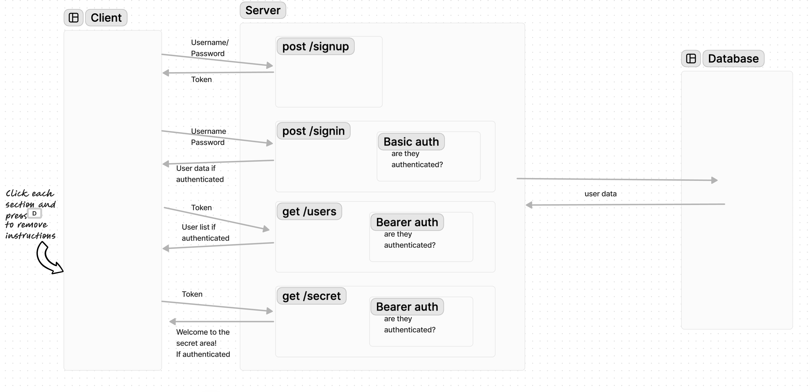

# auth-server

**Author**: Brendan McMullen
**Version**: 1.0.0

## Overview
This server authenticates users with both basic and bearer authentication. Your jwt will expire after 20 seconds but can be renewed by signing in.

## Getting Started
To activate the server install dependencies and type node index.js or nodemon into your shell.

## Architecture
Node.js
express
dotenv
PostgreSQL14
Basic-64
bcrypt

## Change Log

05-7-2024 8:38pm - Full Functionality

## Credit and Collaborations
chatgpt was used as a resource

## UML Diagram
